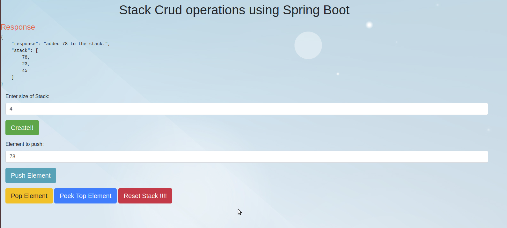

# restful_dataStructures

A Spring Boot and javascript based full stack service which will provide the interface for an *Integer Stack*.
It supports the following operations related to stacks:

1. **Create:** It is used to create a stack of any given size
1. **Push:** It is used to add an element to the stack.
1. **Pop:** It is used to remove the top element of the stack.
1. **Seek** It is used to find the number at the top of the stack.
1. **Reset** It is used to fflush the stack and make it empty.



# Steps to run the project and see the ui

1. Clone the repository
1. Go the repository location and run command: ```./gradlew bootRun ```
1. Open the browser and visit http://localhost:8081

Now we are good to go and all the operations can be performed.

# Github Actions
The project supports project build and docker build whenever there is a push or a pull request to master.

